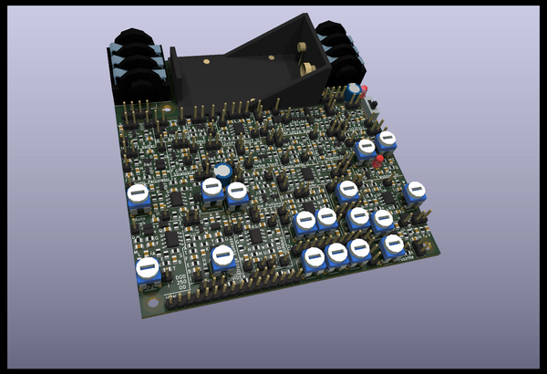

# smd-soldering-exercise-0805
Ultimate SMD soldering exercise full of 0805 resistor and caps, SOT-23 transistors and SOIC-8 opamps - 23 guitar pedals on one 10x10cm PCB.

# Goals
- practice Kicad
- cram as many simple analog pedals on cheapest jlcpcb board (10x10cm, $4 for 5pcs)
- practice smd soldering with my new soldering iron

# What I learned
- how to draw symbols
- how to draw footprints
- how to make 3d models
- how to make dual opamp as 2 separate triangles and separate rails
- how to use pwr flag to fix "power input pin after switch" issue
- how to make my own library of parts with only components I use
- not to reset anotations once I start placing components
- pads could have been bigger
- spacing could have been bigger (especially some SOD-123 diodes)

# Features
- no mojo parts (only SOT-23 2N3904, 2N3906, MMBTJ201, 0805 R/C, SOD-123 diodes, SOIC-8 TL072CDR)
- 1pin headers for chaining pedals together (using 10cm F-F jumper wires for interconnect)
- 2pin headers with jumpers for on/off switch of individual pedals
- small RM065 trimmers
- 2 jacks
- battery holder, switch and led indicator
- 2 extra headers for external pots (blend and volume maybe)
- 2 extra headers with fixed voltage divider to blend signals, e.g. 50:50
- 2 extra 1x4 headers to tie 2-4 nets together
- 5 extra blending trimmers

# Pedals
1. JFET source follower
2. NPN emitter follower
3. Bazz fuss
4. 2x opamp buffer
5. Electra distortion
6. Green ringer (octave up)
7. Fuzz face (1k pot as fixed 2-resistor divider)
8. Harmonic percolator (for input and output pots use universal bottom pots)
9. Alembic stratoblaster (50k variable resistor as fixed single resistor)
10. Bass boost
11. Treble boost
12. Cornish buffer
13. Hyperion
14. Autowah
15. Wobbletron
16. Pushme pullyou
17. 2x opamp phase inverter
18. DOD 250 overdrive
19. Orange Squeezer
20. 2x differential amplifier
21. 2x adjustable non-inverting amplifier
22. Rat
23. Fuzzrite

# Notes
- to save space and cost all pots on the input and output of pedals were removed (there are several pots and trimmers on the bottom you should use)
- in some pedals pots in the middle of pedal were replaced with fixed voltage dividers (experiment and pick good value)
- in general you should adjust individual pedals to your liking and then blend them with other pedals or clean signal
- to cram as much components as possible, instead of long component name like R165 I used single letter (A,B,...) with few reserved letters (I=input,N=NPN,O=output,P=PNP,J=JFET), refer to schematic to see the actual value of component.

# Errata
- there is no dedicated groud header pin anywhere, e.g. for scope ground (solution: you can solder header to one of the large holes)
- autowah doesn't work with floating input (solution: use one of the voltage dividers at the bottom e.g. 47k:47k to move input to 4.5V)
